# Network Science Final Project
Roberto & Gacera

## Network Analysis on the 2019 election city-level results in Ilocos Region


```python
import pickle
import networkx as nx
import community
from networkx.algorithms import bipartite
import numpy as np
import matplotlib.pyplot as plt
import pandas as pd
import collections
import warnings

warnings.filterwarnings("ignore")
%matplotlib inline
```


```python
with open('ILOCOS_nodes_2019.pkl', 'rb') as f:
    nodes = pickle.load(f)

with open('ILOCOS_edges_2019.pkl', 'rb') as f:
    edges = pickle.load(f)
    
with open('ILOCOS_df_2019.pkl', 'rb') as f:
    df = pickle.load(f)
```


```python
nodes.shape
```


    (863, 3)


```python
edges.shape
```


    (5740, 4)


### Create weighted directed bipartite network


```python
G = nx.from_pandas_edgelist(edges, 'Source', 'Target', edge_attr=['Weight', 'Position'], create_using=nx.DiGraph)
```

#### Network statistics


```python
deg = [k for node, k in G.degree(weight='Weight')]
print('Nodes:', G.order())
print('Links:', G.size())
print('Average degree:', np.mean(deg))
print('Min max deg:', np.min(deg), np.max(deg))
print('Ave shortest path:', nx.average_shortest_path_length(G, weight='Weight'))
# print('Diameter:', nx.diameter(G)) - N/A because a directed bipartite network is not strongly connected
# print('Clustering coeff', nx.average_clustering(G, weight='Weight')) - 0 for a bipartite network
```

    Nodes: 771
    Links: 5740
    Average degree: 6.32060279669347
    Min max deg: 0.06192109777015438 116.2747597557863
    Ave shortest path: 0.004104287530320429
    

#### Degree histogram


```python
degree_sequence = sorted([int(d) for n, d in G.degree(weight='Weight')], reverse=True)
degreeCount = collections.Counter(degree_sequence)
deg, cnt = zip(*degreeCount.items())

fig, ax = plt.subplots(dpi=100)
ax.scatter(deg, cnt, color='b', marker='.')
ax.set_title('Ilocos (Bipartite) Weighted Directed Degree Histogram', fontdict={'fontsize': 10})
ax.set_xlabel('Degree', fontdict={'fontsize': 8})
ax.set_ylabel('Count', fontdict={'fontsize': 8});
```


#### Degree histogram (log-scale)


```python
degree_sequence = sorted([int(d) for n, d in G.degree(weight='Weight')], reverse=True)
degreeCount = collections.Counter(degree_sequence)
deg, cnt = zip(*degreeCount.items())

fig, ax = plt.subplots(dpi=100)
ax.scatter(deg, cnt, color='b', marker='.')
ax.set_xscale('log')
ax.set_yscale('log')
ax.set_title('Ilocos (Bipartite) Weighted Directed Degree Histogram (Log-scale)', fontdict={'fontsize': 10})
ax.set_xlabel('Degree', fontdict={'fontsize': 8})
ax.set_ylabel('Count', fontdict={'fontsize': 8});
```


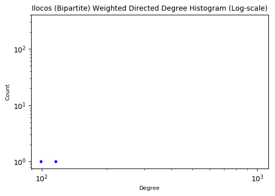


#### Network visualization


```python
pos = nx.fruchterman_reingold_layout(G);

plt.figure(figsize=(12,10))
plt.axis("off")
nx.draw_networkx_nodes(G, pos, node_size=100, node_color="lightblue")
nx.draw_networkx_edges(G, pos, alpha=0.1)
nx.draw_networkx_labels(G, pos, font_color='black', font_size=8)
plt.title('Ilocos Weighted Directed Bipartite Network')
plt.show();
```


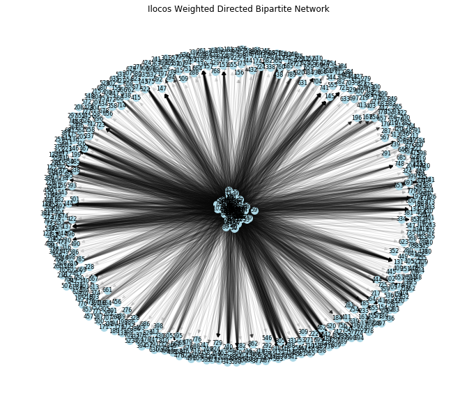


#### Compute for the centralities


```python
n = 5
print('Ilocos (Bipartite) Weighted Directed')

values = []
for x, y in [(i, j) for i, j in sorted(nx.eigenvector_centrality_numpy(G, weight='Weight').items(), key=lambda x: -x[1])][:n]:
    values.append((x, nodes[nodes.Id==x].Label.values[0], y))
display(pd.DataFrame(values, columns=['ID', 'Top 5 Eigenvector Centralities', 'Centrality value']))

values = []
for  x, y in [(i, j) for i, j in sorted(nx.betweenness_centrality(G, weight='Weight').items(), key=lambda x: -x[1])][:n]:
    values.append((x, nodes[nodes.Id==x].Label.values[0], y))
display(pd.DataFrame(values, columns=['ID', 'Top 5 Betweenness Centralities', 'Centrality value']))

values = []
for  x, y in [(i, j) for i, j in sorted(nx.closeness_centrality(G, distance='Weight').items(), key=lambda x: -x[1])][:n]:
    values.append((x, nodes[nodes.Id==x].Label.values[0], y))
display(pd.DataFrame(values, columns=['ID', 'Top 5 Closeness Centralities', 'Centrality value']))
```

    Ilocos (Bipartite) Weighted Directed
    


<div>

<table border="1" class="dataframe">
  <thead>
    <tr style="text-align: right;">
      <th></th>
      <th>ID</th>
      <th>Top 5 Eigenvector Centralities</th>
      <th>Centrality value</th>
    </tr>
  </thead>
  <tbody>
    <tr>
      <th>0</th>
      <td>127</td>
      <td>MARCOS, IMEE (NP)</td>
      <td>0.313288</td>
    </tr>
    <tr>
      <th>1</th>
      <td>741</td>
      <td>172 PHILRECA</td>
      <td>0.261271</td>
    </tr>
    <tr>
      <th>2</th>
      <td>859</td>
      <td>SINGSON, JERRY (BILEG)</td>
      <td>0.199426</td>
    </tr>
    <tr>
      <th>3</th>
      <td>851</td>
      <td>SINGSON, RYAN LUIS (BILEG)</td>
      <td>0.199426</td>
    </tr>
    <tr>
      <th>4</th>
      <td>125</td>
      <td>VILLAR, CYNTHIA (NP)</td>
      <td>0.178708</td>
    </tr>
  </tbody>
</table>
</div>


<div>

<table border="1" class="dataframe">
  <thead>
    <tr style="text-align: right;">
      <th></th>
      <th>ID</th>
      <th>Top 5 Betweenness Centralities</th>
      <th>Centrality value</th>
    </tr>
  </thead>
  <tbody>
    <tr>
      <th>0</th>
      <td>0</td>
      <td>PANGASINAN/VILLASIS</td>
      <td>0.0</td>
    </tr>
    <tr>
      <th>1</th>
      <td>125</td>
      <td>VILLAR, CYNTHIA (NP)</td>
      <td>0.0</td>
    </tr>
    <tr>
      <th>2</th>
      <td>1</td>
      <td>PANGASINAN/URDANETA CITY</td>
      <td>0.0</td>
    </tr>
    <tr>
      <th>3</th>
      <td>2</td>
      <td>PANGASINAN/URBIZTONDO</td>
      <td>0.0</td>
    </tr>
    <tr>
      <th>4</th>
      <td>3</td>
      <td>PANGASINAN/UMINGAN</td>
      <td>0.0</td>
    </tr>
  </tbody>
</table>
</div>


<div>

<table border="1" class="dataframe">
  <thead>
    <tr style="text-align: right;">
      <th></th>
      <th>ID</th>
      <th>Top 5 Closeness Centralities</th>
      <th>Centrality value</th>
    </tr>
  </thead>
  <tbody>
    <tr>
      <th>0</th>
      <td>147</td>
      <td>GADON, LARRY (KBL)</td>
      <td>1.427930</td>
    </tr>
    <tr>
      <th>1</th>
      <td>150</td>
      <td>CHONG, GLENN (KDP)</td>
      <td>1.233736</td>
    </tr>
    <tr>
      <th>2</th>
      <td>146</td>
      <td>MANGUDADATU, DONG (PDPLBN)</td>
      <td>1.119660</td>
    </tr>
    <tr>
      <th>3</th>
      <td>144</td>
      <td>MANICAD, JIGGY (IND)</td>
      <td>0.894601</td>
    </tr>
    <tr>
      <th>4</th>
      <td>149</td>
      <td>COLMENARES, NERI (MKBYN)</td>
      <td>0.877979</td>
    </tr>
  </tbody>
</table>
</div>


### Convert to a weighted undirected bipartite network


```python
G2 = nx.Graph(G)
```

#### Network statistics


```python
deg = [k for node, k in G2.degree(weight='Weight')]
print('Nodes:', G2.order())
print('Links:', G2.size())
print('Average degree:', np.mean(deg))
print('Min max deg:', np.min(deg), np.max(deg))
print('Ave shortest path:', nx.average_shortest_path_length(G2, weight='Weight'))
print('Diameter:', nx.diameter(G2))
# print('Clustering coeff', nx.average_clustering(G2, weight='Weight')) - 0 for a bipartite network
```

    Nodes: 771
    Links: 5740
    Average degree: 6.32060279669347
    Min max deg: 0.06192109777015438 116.2747597557863
    Ave shortest path: 1.232386626574357
    Diameter: 4
    

#### Degree histogram


```python
degree_sequence = sorted([int(d) for n, d in G2.degree(weight='Weight')], reverse=True)
degreeCount = collections.Counter(degree_sequence)
deg, cnt = zip(*degreeCount.items())

fig, ax = plt.subplots(dpi=100)
ax.scatter(deg, cnt, color='b', marker='.')
ax.set_title('Ilocos (Bipartite) Weighted Undirected Degree Histogram', fontdict={'fontsize': 10})
ax.set_xlabel('Degree', fontdict={'fontsize': 8})
ax.set_ylabel('Count', fontdict={'fontsize': 8});
```


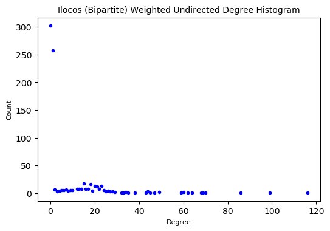


#### Degree histogram (log-scale)


```python
degree_sequence = sorted([int(d) for n, d in G2.degree(weight='Weight')], reverse=True)
degreeCount = collections.Counter(degree_sequence)
deg, cnt = zip(*degreeCount.items())

fig, ax = plt.subplots(dpi=100)
ax.scatter(deg, cnt, color='b', marker='.')
ax.set_xscale('log')
ax.set_yscale('log')
ax.set_title('Ilocos (Bipartite) Weighted Undirected Degree Histogram (Log-scale)', fontdict={'fontsize': 10})
ax.set_xlabel('Degree', fontdict={'fontsize': 8})
ax.set_ylabel('Count', fontdict={'fontsize': 8});
```


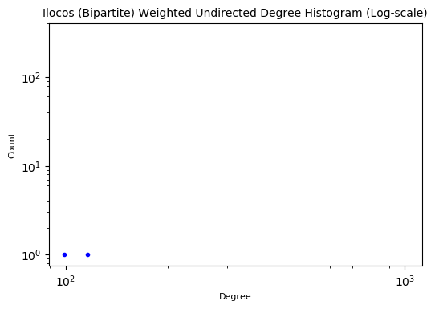


#### Network visualization


```python
pos = nx.fruchterman_reingold_layout(G2);

plt.figure(figsize=(12,10))
plt.axis("off")
nx.draw_networkx_nodes(G2, pos, node_size=100, node_color="lightblue")
nx.draw_networkx_edges(G2, pos, alpha=0.1)
nx.draw_networkx_labels(G2, pos, font_color='black', font_size=8)
plt.title('Ilocos Weighted Unirected Bipartite Network')
plt.show();
```


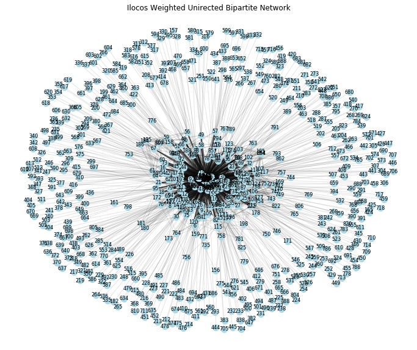


#### Compute for the centralities


```python
n = 5
print('Ilocos (Bipartite) Weighted Undirected')

values = []
for x, y in [(i, j) for i, j in sorted(nx.eigenvector_centrality_numpy(G2, weight='Weight').items(), key=lambda x: -x[1])][:n]:
    values.append((x, nodes[nodes.Id==x].Label.values[0], y))
display(pd.DataFrame(values, columns=['ID', 'Top 5 Eigenvector Centralities', 'Centrality value']))

values = []
for  x, y in [(i, j) for i, j in sorted(nx.betweenness_centrality(G2, weight='Weight').items(), key=lambda x: -x[1])][:n]:
    values.append((x, nodes[nodes.Id==x].Label.values[0], y))
display(pd.DataFrame(values, columns=['ID', 'Top 5 Betweenness Centralities', 'Centrality value']))

values = []
for  x, y in [(i, j) for i, j in sorted(nx.closeness_centrality(G2, distance='Weight').items(), key=lambda x: -x[1])][:n]:
    values.append((x, nodes[nodes.Id==x].Label.values[0], y))
display(pd.DataFrame(values, columns=['ID', 'Top 5 Closeness Centralities', 'Centrality value']))
```

    Ilocos (Bipartite) Weighted Undirected
    


<div>

<table border="1" class="dataframe">
  <thead>
    <tr style="text-align: right;">
      <th></th>
      <th>ID</th>
      <th>Top 5 Eigenvector Centralities</th>
      <th>Centrality value</th>
    </tr>
  </thead>
  <tbody>
    <tr>
      <th>0</th>
      <td>127</td>
      <td>MARCOS, IMEE (NP)</td>
      <td>0.242205</td>
    </tr>
    <tr>
      <th>1</th>
      <td>125</td>
      <td>VILLAR, CYNTHIA (NP)</td>
      <td>0.224564</td>
    </tr>
    <tr>
      <th>2</th>
      <td>126</td>
      <td>POE, GRACE (IND)</td>
      <td>0.199519</td>
    </tr>
    <tr>
      <th>3</th>
      <td>128</td>
      <td>LAPID, LITO (NPC)</td>
      <td>0.160052</td>
    </tr>
    <tr>
      <th>4</th>
      <td>129</td>
      <td>CAYETANO, PIA (NP)</td>
      <td>0.159754</td>
    </tr>
  </tbody>
</table>
</div>


<div>

<table border="1" class="dataframe">
  <thead>
    <tr style="text-align: right;">
      <th></th>
      <th>ID</th>
      <th>Top 5 Betweenness Centralities</th>
      <th>Centrality value</th>
    </tr>
  </thead>
  <tbody>
    <tr>
      <th>0</th>
      <td>150</td>
      <td>CHONG, GLENN (KDP)</td>
      <td>0.186557</td>
    </tr>
    <tr>
      <th>1</th>
      <td>147</td>
      <td>GADON, LARRY (KBL)</td>
      <td>0.098917</td>
    </tr>
    <tr>
      <th>2</th>
      <td>154</td>
      <td>AGUILAR, FREDDIE (IND)</td>
      <td>0.076206</td>
    </tr>
    <tr>
      <th>3</th>
      <td>151</td>
      <td>ALEJANO, GARY (LP)</td>
      <td>0.050313</td>
    </tr>
    <tr>
      <th>4</th>
      <td>145</td>
      <td>DIOKNO, CHEL (LP)</td>
      <td>0.046365</td>
    </tr>
  </tbody>
</table>
</div>


<div>

<table border="1" class="dataframe">
  <thead>
    <tr style="text-align: right;">
      <th></th>
      <th>ID</th>
      <th>Top 5 Closeness Centralities</th>
      <th>Centrality value</th>
    </tr>
  </thead>
  <tbody>
    <tr>
      <th>0</th>
      <td>147</td>
      <td>GADON, LARRY (KBL)</td>
      <td>1.536545</td>
    </tr>
    <tr>
      <th>1</th>
      <td>150</td>
      <td>CHONG, GLENN (KDP)</td>
      <td>1.515875</td>
    </tr>
    <tr>
      <th>2</th>
      <td>146</td>
      <td>MANGUDADATU, DONG (PDPLBN)</td>
      <td>1.487169</td>
    </tr>
    <tr>
      <th>3</th>
      <td>154</td>
      <td>AGUILAR, FREDDIE (IND)</td>
      <td>1.475346</td>
    </tr>
    <tr>
      <th>4</th>
      <td>149</td>
      <td>COLMENARES, NERI (MKBYN)</td>
      <td>1.473901</td>
    </tr>
  </tbody>
</table>
</div>


### Create projected city and politician networks from the weighted undirected bipartite network

#### Create attribute `bipartite` to distinguish between city and politician


```python
nodes['bipartite'] = 1
nodes.loc[nodes.Node_Type=='CITY', 'bipartite'] = 0
```

#### Add attributes `Label`, `Node_Type` and `bipartite` to the network


```python
for i in sorted(G2.nodes()):
    G2.nodes[i]['Label'] = nodes.Label[i]
    G2.nodes[i]['Node_Type'] = nodes.Node_Type[i]
    G2.nodes[i]['bipartite'] = nodes.bipartite[i]
```

#### Distinguish the types of nodes:
- top_nodes: city nodes
- bottom_nodes: politician nodes


```python
top_nodes = {n for n, d in G2.nodes(data=True) if d['bipartite']==0}
bottom_nodes = set(G2) - top_nodes
```

#### Define weight function to be used to compute for the edge weight of the projected networks


```python
def weight_func(Gr, u, v):
    w = []
    for x in set(Gr[u]) & set(Gr[v]):
        w.append(Gr[u][x]['Weight'])
        w.append(Gr[v][x]['Weight'])
    return np.mean(w)
```

#### Project the bipartite network into city and politician networks with the computed weight for each edge using the weight function


```python
G_city = bipartite.generic_weighted_projected_graph(G2, top_nodes, weight_function=weight_func)
G_pol = bipartite.generic_weighted_projected_graph(G2, bottom_nodes, weight_function=weight_func)
```

### Projected city network

#### Network statistics


```python
deg = [k for node, k in G_city.degree(weight='weight')]
print('Nodes:', G_city.order())
print('Links:', G_city.size())
print('Average degree:', np.mean(deg))
print('Min max deg:', np.min(deg), np.max(deg))
print('Ave shortest path:', nx.average_shortest_path_length(G_city, weight='weight'))
print('Diameter:', nx.diameter(G_city))
print('Clustering coeff', nx.average_clustering(G_city, weight='weight'))
```

    Nodes: 125
    Links: 7750
    Average degree: 48.954825098633634
    Min max deg: 41.435383590993865 59.24880501306973
    Ave shortest path: 0.3947969766018852
    Diameter: 1
    Clustering coeff 0.6819814939594768
    

#### Network visualization


```python
pos = nx.fruchterman_reingold_layout(G_city);

plt.figure(figsize=(12,10))
plt.axis("off")
nx.draw_networkx_nodes(G_city, pos, node_size=300, node_color="lightpink")
nx.draw_networkx_edges(G_city, pos, alpha=0.1)
nx.draw_networkx_labels(G_city, pos, font_color='black', font_size=8)
plt.title('Ilocos Projected City Network')
plt.show();
```


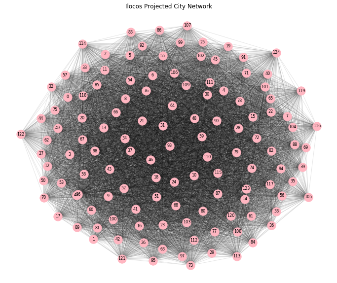


### Projected politician network

#### Network statistics


```python
deg = [k for node, k in G_pol.degree(weight='weight')]
print('Nodes:', G_pol.order())
print('Links:', G_pol.size())
print('Average degree:', np.mean(deg))
print('Min max deg:', np.min(deg), np.max(deg))
print('Ave shortest path:', nx.average_shortest_path_length(G_pol, weight='weight'))
print('Diameter:', nx.diameter(G_pol))
print('Clustering coeff', nx.average_clustering(G_pol, weight='weight'))
```

    Nodes: 646
    Links: 28757
    Average degree: 47.43046030572855
    Min max deg: 7.4252768069538675 511.9924714994601
    Ave shortest path: 0.7335501005412872
    Diameter: 2
    Clustering coeff 0.4467268686607608
    

#### Degree histogram


```python
degree_sequence = sorted([int(d) for n, d in G_pol.degree(weight='weight')], reverse=True)
degreeCount = collections.Counter(degree_sequence)
deg, cnt = zip(*degreeCount.items())

fig, ax = plt.subplots(dpi=100)
ax.scatter(deg, cnt, color='b', marker='.')
ax.set_title('Ilocos Projected (Politicians) Weighted Degree Histogram', fontdict={'fontsize': 10})
ax.set_xlabel('Degree', fontdict={'fontsize': 8})
ax.set_ylabel('Count', fontdict={'fontsize': 8});
```


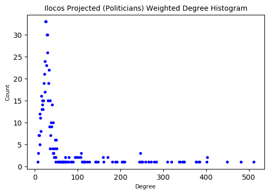


#### Degree histogram (log-scale)


```python
degree_sequence = sorted([int(d) for n, d in G_pol.degree(weight='weight')], reverse=True)
degreeCount = collections.Counter(degree_sequence)
deg, cnt = zip(*degreeCount.items())

fig, ax = plt.subplots(dpi=100)
ax.scatter(deg, cnt, color='b', marker='.')
ax.set_xscale('log')
ax.set_yscale('log')
ax.set_title('Ilocos Projected (Politicians) Weighted Degree Histogram (Log-scale)', fontdict={'fontsize': 10})
ax.set_xlabel('Degree', fontdict={'fontsize': 8})
ax.set_ylabel('Count', fontdict={'fontsize': 8});
```


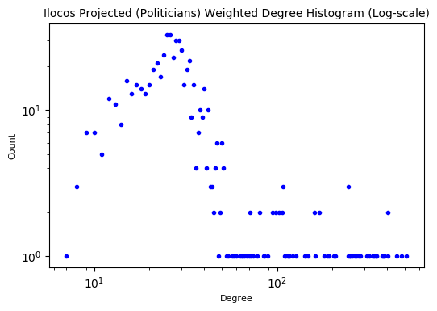


#### Network visualization


```python
pos = nx.fruchterman_reingold_layout(G_pol);

plt.figure(figsize=(12,10))
plt.axis("off")
nx.draw_networkx_nodes(G_pol, pos, node_size=100, node_color="lightpink")
nx.draw_networkx_edges(G_pol, pos, alpha=0.1)
nx.draw_networkx_labels(G_pol, pos, font_color='black', font_size=6)
plt.title('Ilocos Projected Politician Network')
plt.show();
```


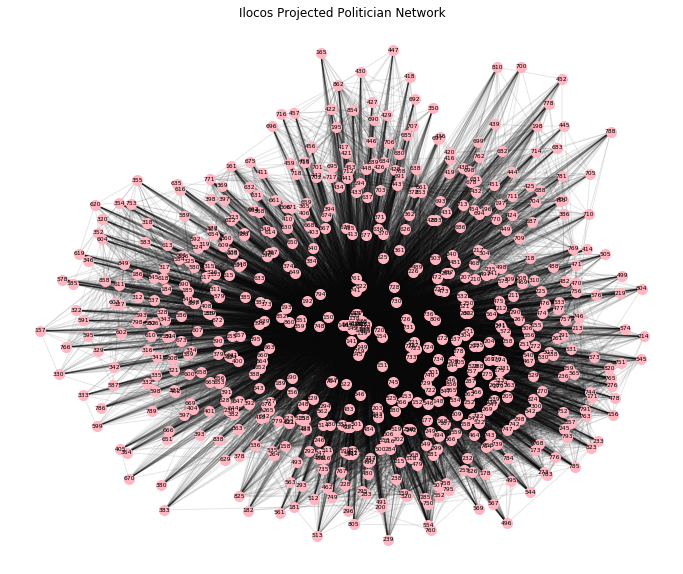


#### Compute for the centralities


```python
n = 5
print('Ilocos Projected (Politicians) Weighted Network')

values = []
for x, y in [(i, j) for i, j in sorted(nx.eigenvector_centrality(G_pol, weight='weight').items(), key=lambda x: -x[1])][:n]:
    values.append((x, nodes[nodes.Id==x].Label.values[0], y))
display(pd.DataFrame(values, columns=['ID', 'Top 5 Eigenvector Centralities', 'Centrality value']))

values = []
for  x, y in [(i, j) for i, j in sorted(nx.betweenness_centrality(G_pol, weight='weight').items(), key=lambda x: -x[1])][:n]:
    values.append((x, nodes[nodes.Id==x].Label.values[0], y))
display(pd.DataFrame(values, columns=['ID', 'Top 5 Betweenness Centralities', 'Centrality value']))

values = []
for  x, y in [(i, j) for i, j in sorted(nx.closeness_centrality(G_pol, distance='weight').items(), key=lambda x: -x[1])][:n]:
    values.append((x, nodes[nodes.Id==x].Label.values[0], y))
display(pd.DataFrame(values, columns=['ID', 'Top 5 Closeness Centralities', 'Centrality value']))
```

    Ilocos Projected (Politicians) Weighted Network
    


<div>

<table border="1" class="dataframe">
  <thead>
    <tr style="text-align: right;">
      <th></th>
      <th>ID</th>
      <th>Top 5 Eigenvector Centralities</th>
      <th>Centrality value</th>
    </tr>
  </thead>
  <tbody>
    <tr>
      <th>0</th>
      <td>127</td>
      <td>MARCOS, IMEE (NP)</td>
      <td>0.175486</td>
    </tr>
    <tr>
      <th>1</th>
      <td>125</td>
      <td>VILLAR, CYNTHIA (NP)</td>
      <td>0.169140</td>
    </tr>
    <tr>
      <th>2</th>
      <td>126</td>
      <td>POE, GRACE (IND)</td>
      <td>0.158957</td>
    </tr>
    <tr>
      <th>3</th>
      <td>128</td>
      <td>LAPID, LITO (NPC)</td>
      <td>0.143260</td>
    </tr>
    <tr>
      <th>4</th>
      <td>129</td>
      <td>CAYETANO, PIA (NP)</td>
      <td>0.143014</td>
    </tr>
  </tbody>
</table>
</div>


<div>

<table border="1" class="dataframe">
  <thead>
    <tr style="text-align: right;">
      <th></th>
      <th>ID</th>
      <th>Top 5 Betweenness Centralities</th>
      <th>Centrality value</th>
    </tr>
  </thead>
  <tbody>
    <tr>
      <th>0</th>
      <td>150</td>
      <td>CHONG, GLENN (KDP)</td>
      <td>0.177649</td>
    </tr>
    <tr>
      <th>1</th>
      <td>147</td>
      <td>GADON, LARRY (KBL)</td>
      <td>0.093832</td>
    </tr>
    <tr>
      <th>2</th>
      <td>154</td>
      <td>AGUILAR, FREDDIE (IND)</td>
      <td>0.076460</td>
    </tr>
    <tr>
      <th>3</th>
      <td>151</td>
      <td>ALEJANO, GARY (LP)</td>
      <td>0.055756</td>
    </tr>
    <tr>
      <th>4</th>
      <td>149</td>
      <td>COLMENARES, NERI (MKBYN)</td>
      <td>0.040498</td>
    </tr>
  </tbody>
</table>
</div>


<div>

<table border="1" class="dataframe">
  <thead>
    <tr style="text-align: right;">
      <th></th>
      <th>ID</th>
      <th>Top 5 Closeness Centralities</th>
      <th>Centrality value</th>
    </tr>
  </thead>
  <tbody>
    <tr>
      <th>0</th>
      <td>147</td>
      <td>GADON, LARRY (KBL)</td>
      <td>2.560987</td>
    </tr>
    <tr>
      <th>1</th>
      <td>150</td>
      <td>CHONG, GLENN (KDP)</td>
      <td>2.499445</td>
    </tr>
    <tr>
      <th>2</th>
      <td>146</td>
      <td>MANGUDADATU, DONG (PDPLBN)</td>
      <td>2.462764</td>
    </tr>
    <tr>
      <th>3</th>
      <td>149</td>
      <td>COLMENARES, NERI (MKBYN)</td>
      <td>2.421552</td>
    </tr>
    <tr>
      <th>4</th>
      <td>154</td>
      <td>AGUILAR, FREDDIE (IND)</td>
      <td>2.420444</td>
    </tr>
  </tbody>
</table>
</div>


### Filter the projected politicians network to edges with weight greater than threshold


```python
print('Remove', len([(u, v) for u, v, w in G_pol.edges(data=True) if w['weight'] <= 0.5]), 'edges')
print('Retain', len([(u, v) for u, v, w in G_pol.edges(data=True) if w['weight'] > 0.5]), 'edges')
```

    Remove 11182 edges
    Retain 17575 edges
    

#### Filter edges


```python
G_pol.remove_edges_from([(u, v) for u, v, w in G_pol.edges(data=True) if w['weight'] <= 0.5])
```


```python
len(G_pol.edges)
```


    17575


#### Network statistics


```python
deg = [k for node, k in G_pol.degree(weight='weight')]
print('Nodes:', G_pol.order())
print('Links:', G_pol.size())
print('Average degree:', np.mean(deg))
print('Min max deg:', np.min(deg), np.max(deg))
print('Ave shortest path:', nx.average_shortest_path_length(G_pol, weight='weight'))
print('Diameter:', nx.diameter(G_pol))
print('Clustering coeff', nx.average_clustering(G_pol, weight='weight'))
```

    Nodes: 646
    Links: 17575
    Average degree: 37.32374540130319
    Min max deg: 3.7188689505165846 486.9440772823392
    Ave shortest path: 1.1567543970986354
    Diameter: 3
    Clustering coeff 0.37560593881723847
    

#### Degree histogram


```python
degree_sequence = sorted([int(d) for n, d in G_pol.degree(weight='weight')], reverse=True)
degreeCount = collections.Counter(degree_sequence)
deg, cnt = zip(*degreeCount.items())

fig, ax = plt.subplots(dpi=100)
ax.scatter(deg, cnt, color='b', marker='.')
ax.set_title('Ilocos Projected Politicians (Filtered) Weighted Degree Histogram', fontdict={'fontsize': 10})
ax.set_xlabel('Degree', fontdict={'fontsize': 8})
ax.set_ylabel('Count', fontdict={'fontsize': 8});
```


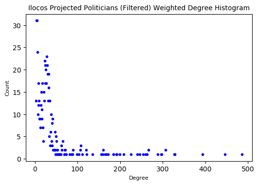


#### Degree histogram (log-scale)


```python
degree_sequence = sorted([int(d) for n, d in G_pol.degree(weight='weight')], reverse=True)
degreeCount = collections.Counter(degree_sequence)
deg, cnt = zip(*degreeCount.items())

fig, ax = plt.subplots(dpi=100)
ax.scatter(deg, cnt, color='b', marker='.')
ax.set_xscale('log')
ax.set_yscale('log')
ax.set_title('Ilocos Projected Politicians (Filtered) Weighted Degree Histogram (Log-scale)', fontdict={'fontsize': 9})
ax.set_xlabel('Degree', fontdict={'fontsize': 8})
ax.set_ylabel('Count', fontdict={'fontsize': 8});
```


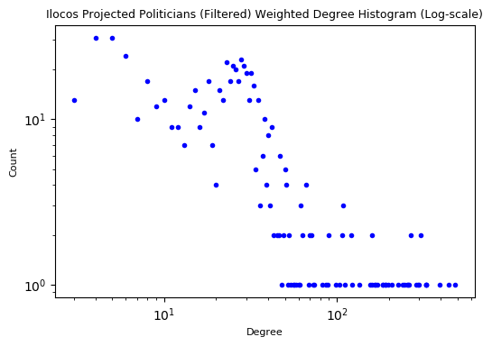


#### Network visualization


```python
pos = nx.fruchterman_reingold_layout(G_pol);

plt.figure(figsize=(12,10))
plt.axis("off")
nx.draw_networkx_nodes(G_pol, pos, node_size=150, node_color="lightpink")
nx.draw_networkx_edges(G_pol, pos, alpha=0.1)
nx.draw_networkx_labels(G_pol, pos, font_color='black', font_size=6)
plt.title('Ilocos Projected Politician (Filtered) Network')
plt.show();
```


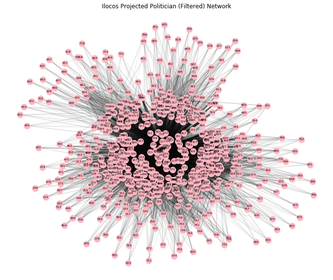


#### Compute for the centralities


```python
n = 5
print('Ilocos Projected Politicians (Filtered) Weighted Network')

values = []
for x, y in [(i, j) for i, j in sorted(nx.eigenvector_centrality(G_pol, weight='weight').items(), key=lambda x: -x[1])][:n]:
    values.append((x, nodes[nodes.Id==x].Label.values[0], y))
display(pd.DataFrame(values, columns=['ID', 'Top 5 Eigenvector Centralities', 'Centrality value']))

values = []
for  x, y in [(i, j) for i, j in sorted(nx.betweenness_centrality(G_pol, weight='weight').items(), key=lambda x: -x[1])][:n]:
    values.append((x, nodes[nodes.Id==x].Label.values[0], y))
display(pd.DataFrame(values, columns=['ID', 'Top 5 Betweenness Centralities', 'Centrality value']))

values = []
for  x, y in [(i, j) for i, j in sorted(nx.closeness_centrality(G_pol, distance='weight').items(), key=lambda x: -x[1])][:n]:
    values.append((x, nodes[nodes.Id==x].Label.values[0], y))
display(pd.DataFrame(values, columns=['ID', 'Top 5 Closeness Centralities', 'Centrality value']))
```

    Ilocos Projected Politicians (Filtered) Weighted Network
    


<div>

<table border="1" class="dataframe">
  <thead>
    <tr style="text-align: right;">
      <th></th>
      <th>ID</th>
      <th>Top 5 Eigenvector Centralities</th>
      <th>Centrality value</th>
    </tr>
  </thead>
  <tbody>
    <tr>
      <th>0</th>
      <td>127</td>
      <td>MARCOS, IMEE (NP)</td>
      <td>0.196649</td>
    </tr>
    <tr>
      <th>1</th>
      <td>125</td>
      <td>VILLAR, CYNTHIA (NP)</td>
      <td>0.187553</td>
    </tr>
    <tr>
      <th>2</th>
      <td>126</td>
      <td>POE, GRACE (IND)</td>
      <td>0.171188</td>
    </tr>
    <tr>
      <th>3</th>
      <td>128</td>
      <td>LAPID, LITO (NPC)</td>
      <td>0.147816</td>
    </tr>
    <tr>
      <th>4</th>
      <td>129</td>
      <td>CAYETANO, PIA (NP)</td>
      <td>0.147252</td>
    </tr>
  </tbody>
</table>
</div>


<div>

<table border="1" class="dataframe">
  <thead>
    <tr style="text-align: right;">
      <th></th>
      <th>ID</th>
      <th>Top 5 Betweenness Centralities</th>
      <th>Centrality value</th>
    </tr>
  </thead>
  <tbody>
    <tr>
      <th>0</th>
      <td>127</td>
      <td>MARCOS, IMEE (NP)</td>
      <td>0.099229</td>
    </tr>
    <tr>
      <th>1</th>
      <td>125</td>
      <td>VILLAR, CYNTHIA (NP)</td>
      <td>0.070526</td>
    </tr>
    <tr>
      <th>2</th>
      <td>126</td>
      <td>POE, GRACE (IND)</td>
      <td>0.056300</td>
    </tr>
    <tr>
      <th>3</th>
      <td>720</td>
      <td>101 ACT-CIS</td>
      <td>0.046743</td>
    </tr>
    <tr>
      <th>4</th>
      <td>150</td>
      <td>CHONG, GLENN (KDP)</td>
      <td>0.043180</td>
    </tr>
  </tbody>
</table>
</div>


<div>

<table border="1" class="dataframe">
  <thead>
    <tr style="text-align: right;">
      <th></th>
      <th>ID</th>
      <th>Top 5 Closeness Centralities</th>
      <th>Centrality value</th>
    </tr>
  </thead>
  <tbody>
    <tr>
      <th>0</th>
      <td>138</td>
      <td>PIMENTEL, KOKO (PDPLBN)</td>
      <td>1.197728</td>
    </tr>
    <tr>
      <th>1</th>
      <td>137</td>
      <td>TOLENTINO, FRANCIS (PDPLBN)</td>
      <td>1.190192</td>
    </tr>
    <tr>
      <th>2</th>
      <td>139</td>
      <td>AQUINO, BENIGNO BAM  (LP)</td>
      <td>1.189054</td>
    </tr>
    <tr>
      <th>3</th>
      <td>135</td>
      <td>EJERCITO, ESTRADA JV (NPC)</td>
      <td>1.188155</td>
    </tr>
    <tr>
      <th>4</th>
      <td>136</td>
      <td>ESTRADA, JINGGOY (PMP)</td>
      <td>1.187387</td>
    </tr>
  </tbody>
</table>
</div>


### Get communities of the projected politicians network


```python
partition = community.best_partition(G_pol, weight='weight')
```

#### Visualize communties in the network


```python
pos = nx.fruchterman_reingold_layout(G_pol);

plt.figure(figsize=(12,10))
plt.axis('off')

nx.draw_networkx_nodes(G_pol, pos, cmap=plt.cm.YlOrRd, node_color=list(partition.values()))
nx.draw_networkx_edges(G_pol, pos, alpha=0.1)
nx.draw_networkx_labels(G_pol, pos, font_size=8)
plt.title('Ilocos Projected Politician (Filtered) Network - Communities')
plt.show()
```


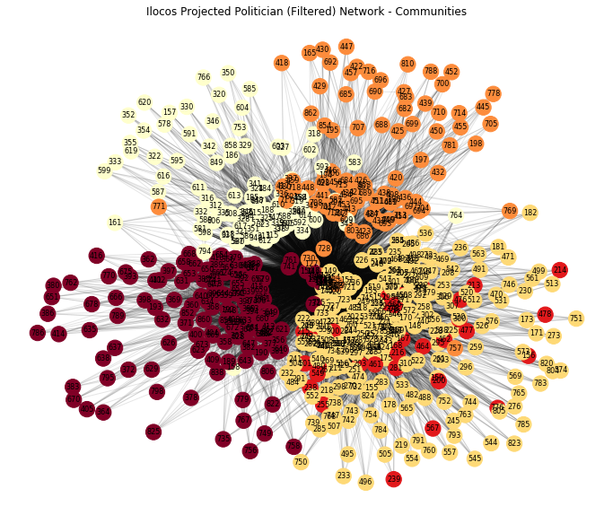


#### Create dataframe of communities


```python
coms = pd.DataFrame(partition.items(), columns=['Id', 'Partition'])
coms = pd.merge(coms, nodes, how='left')
coms.Partition.unique()
```


    array([0, 1, 2, 3, 4])


```python
coms.head(2)
```


<div>

<table border="1" class="dataframe">
  <thead>
    <tr style="text-align: right;">
      <th></th>
      <th>Id</th>
      <th>Partition</th>
      <th>Label</th>
      <th>Node_Type</th>
      <th>bipartite</th>
    </tr>
  </thead>
  <tbody>
    <tr>
      <th>0</th>
      <td>125</td>
      <td>0</td>
      <td>VILLAR, CYNTHIA (NP)</td>
      <td>NP</td>
      <td>1</td>
    </tr>
    <tr>
      <th>1</th>
      <td>126</td>
      <td>1</td>
      <td>POE, GRACE (IND)</td>
      <td>IND</td>
      <td>1</td>
    </tr>
  </tbody>
</table>
</div>


#### Create subgraph for each community


```python
parts = coms.groupby('Partition').Id.apply(list).reset_index()
```


```python
p0 = G_pol.subgraph(parts.loc[0].Id)
p1 = G_pol.subgraph(parts.loc[1].Id)
p2 = G_pol.subgraph(parts.loc[2].Id)
p3 = G_pol.subgraph(parts.loc[3].Id)
p4 = G_pol.subgraph(parts.loc[4].Id)
```

#### Network statistics


```python
for i, p in enumerate([p0, p1, p2, p3, p4]):
    print('Ilocos Politician - Community '+str(i), '\n')
    deg = [k for node, k in p.degree(weight='weight')]
    print('Nodes:', p.order())
    print('Links:', p.size())
    print('Average degree:', np.mean(deg))
    print('Min max deg:', np.min(deg), np.max(deg))
    print('Ave shortest path:', nx.average_shortest_path_length(p, weight='weight'))
    print('Diameter:', nx.diameter(p))
    print('Clustering coeff', nx.average_clustering(p, weight='weight'))
    print('----------------------------------\n')
```

    Ilocos Politician - Community 0 
    
    Nodes: 106
    Links: 1002
    Average degree: 14.239748590120994
    Min max deg: 2.835791264889393 88.03962155267693
    Ave shortest path: 1.1794511573737974
    Diameter: 2
    Clustering coeff 0.5775933721734442
    ----------------------------------
    
    Ilocos Politician - Community 1 
    
    Nodes: 253
    Links: 4851
    Average degree: 26.50866333307405
    Min max deg: 2.6634750116767862 195.02791618489414
    Ave shortest path: 1.1195223071990803
    Diameter: 3
    Clustering coeff 0.37660009739567707
    ----------------------------------
    
    Ilocos Politician - Community 2 
    
    Nodes: 102
    Links: 874
    Average degree: 13.080261329611485
    Min max deg: 2.65905383360522 86.02684888426431
    Ave shortest path: 1.2655099662674227
    Diameter: 2
    Clustering coeff 0.5890796214806147
    ----------------------------------
    
    Ilocos Politician - Community 3 
    
    Nodes: 35
    Links: 140
    Average degree: 6.158182636724287
    Min max deg: 1.6278730703259006 26.65965592505148
    Ave shortest path: 1.2413249935894883
    Diameter: 3
    Clustering coeff 0.6826090770170975
    ----------------------------------
    
    Ilocos Politician - Community 4 
    
    Nodes: 150
    Links: 1843
    Average degree: 17.765596327383214
    Min max deg: 2.7880325674771362 128.58765530975987
    Ave shortest path: 1.147395168006773
    Diameter: 2
    Clustering coeff 0.44606212431164816
    ----------------------------------
    
    

#### Network visualization


```python
for i, p in enumerate([p0, p1, p2, p3, p4]):
    pos = nx.fruchterman_reingold_layout(p)
    plt.figure(figsize=(12,10))
    plt.axis("off")
    nx.draw_networkx_nodes(p, pos, node_size=300, node_color="orange")
    nx.draw_networkx_edges(p, pos, alpha=0.1)
    nx.draw_networkx_labels(p, pos, font_color='black', font_size=8)
    plt.title('Ilocos Politician - Community '+str(i))
    plt.show();
```


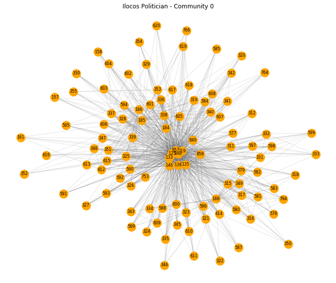


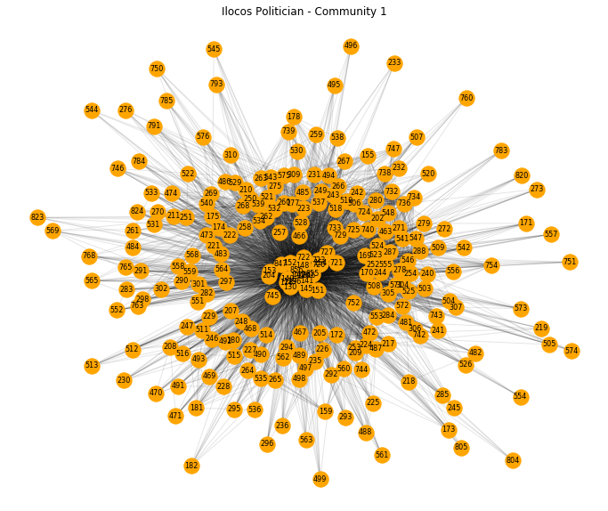


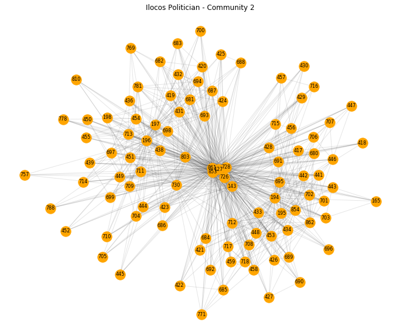


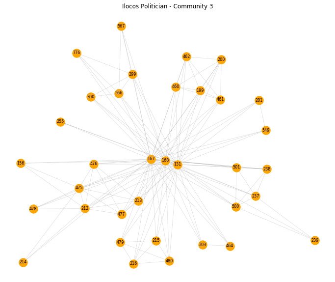


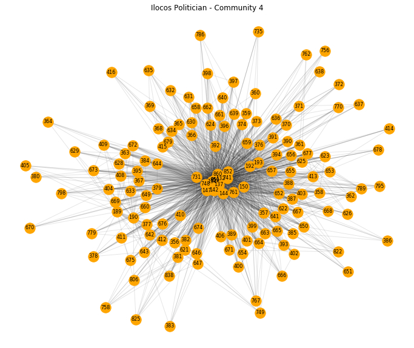


```python
n = 5
for i, p in enumerate([p0, p1, p2, p3, p4]):
    print('Ilocos Politician - Community '+str(i))
    
    values = []
    for x, y in [(i, j) for i, j in sorted(nx.eigenvector_centrality(p, weight='weight').items(), key=lambda x: -x[1])][:n]:
        values.append((x, nodes[nodes.Id==x].Label.values[0], y))
    display(pd.DataFrame(values, columns=['ID', 'Top 5 Eigenvector Centralities', 'Centrality value']))

    values = []
    for  x, y in [(i, j) for i, j in sorted(nx.betweenness_centrality(p, weight='weight').items(), key=lambda x: -x[1])][:n]:
        values.append((x, nodes[nodes.Id==x].Label.values[0], y))
    display(pd.DataFrame(values, columns=['ID', 'Top 5 Betweenness Centralities', 'Centrality value']))

    values = []
    for  x, y in [(i, j) for i, j in sorted(nx.closeness_centrality(p, distance='weight').items(), key=lambda x: -x[1])][:n]:
        values.append((x, nodes[nodes.Id==x].Label.values[0], y))
    display(pd.DataFrame(values, columns=['ID', 'Top 5 Closeness Centralities', 'Centrality value']))
```

    Ilocos Politician - Community 0
    


<div>

<table border="1" class="dataframe">
  <thead>
    <tr style="text-align: right;">
      <th></th>
      <th>ID</th>
      <th>Top 5 Eigenvector Centralities</th>
      <th>Centrality value</th>
    </tr>
  </thead>
  <tbody>
    <tr>
      <th>0</th>
      <td>857</td>
      <td>ORTEGA, MARIO EDUARDO (NUP)</td>
      <td>0.298579</td>
    </tr>
    <tr>
      <th>1</th>
      <td>848</td>
      <td>ORTEGA, PACOY (PDPLBN)</td>
      <td>0.298579</td>
    </tr>
    <tr>
      <th>2</th>
      <td>719</td>
      <td>76 ABONO</td>
      <td>0.290366</td>
    </tr>
    <tr>
      <th>3</th>
      <td>125</td>
      <td>VILLAR, CYNTHIA (NP)</td>
      <td>0.259444</td>
    </tr>
    <tr>
      <th>4</th>
      <td>185</td>
      <td>ERIGUEL, SANDRA (PDPLBN)</td>
      <td>0.199745</td>
    </tr>
  </tbody>
</table>
</div>


<div>

<table border="1" class="dataframe">
  <thead>
    <tr style="text-align: right;">
      <th></th>
      <th>ID</th>
      <th>Top 5 Betweenness Centralities</th>
      <th>Centrality value</th>
    </tr>
  </thead>
  <tbody>
    <tr>
      <th>0</th>
      <td>125</td>
      <td>VILLAR, CYNTHIA (NP)</td>
      <td>0.260989</td>
    </tr>
    <tr>
      <th>1</th>
      <td>146</td>
      <td>MANGUDADATU, DONG (PDPLBN)</td>
      <td>0.101465</td>
    </tr>
    <tr>
      <th>2</th>
      <td>138</td>
      <td>PIMENTEL, KOKO (PDPLBN)</td>
      <td>0.096886</td>
    </tr>
    <tr>
      <th>3</th>
      <td>719</td>
      <td>76 ABONO</td>
      <td>0.055876</td>
    </tr>
    <tr>
      <th>4</th>
      <td>133</td>
      <td>BINAY, NANCY (UNA)</td>
      <td>0.054762</td>
    </tr>
  </tbody>
</table>
</div>


<div>

<table border="1" class="dataframe">
  <thead>
    <tr style="text-align: right;">
      <th></th>
      <th>ID</th>
      <th>Top 5 Closeness Centralities</th>
      <th>Centrality value</th>
    </tr>
  </thead>
  <tbody>
    <tr>
      <th>0</th>
      <td>857</td>
      <td>ORTEGA, MARIO EDUARDO (NUP)</td>
      <td>1.192645</td>
    </tr>
    <tr>
      <th>1</th>
      <td>848</td>
      <td>ORTEGA, PACOY (PDPLBN)</td>
      <td>1.192645</td>
    </tr>
    <tr>
      <th>2</th>
      <td>125</td>
      <td>VILLAR, CYNTHIA (NP)</td>
      <td>1.191539</td>
    </tr>
    <tr>
      <th>3</th>
      <td>138</td>
      <td>PIMENTEL, KOKO (PDPLBN)</td>
      <td>1.168867</td>
    </tr>
    <tr>
      <th>4</th>
      <td>719</td>
      <td>76 ABONO</td>
      <td>1.158311</td>
    </tr>
  </tbody>
</table>
</div>


    Ilocos Politician - Community 1
    


<div>

<table border="1" class="dataframe">
  <thead>
    <tr style="text-align: right;">
      <th></th>
      <th>ID</th>
      <th>Top 5 Eigenvector Centralities</th>
      <th>Centrality value</th>
    </tr>
  </thead>
  <tbody>
    <tr>
      <th>0</th>
      <td>846</td>
      <td>ESPINO, AMADO III (PDPLBN)</td>
      <td>0.231122</td>
    </tr>
    <tr>
      <th>1</th>
      <td>856</td>
      <td>LAMBINO, MARK (NPC)</td>
      <td>0.228319</td>
    </tr>
    <tr>
      <th>2</th>
      <td>126</td>
      <td>POE, GRACE (IND)</td>
      <td>0.209942</td>
    </tr>
    <tr>
      <th>3</th>
      <td>128</td>
      <td>LAPID, LITO (NPC)</td>
      <td>0.183123</td>
    </tr>
    <tr>
      <th>4</th>
      <td>847</td>
      <td>CELESTE, ARTHUR (NP)</td>
      <td>0.182729</td>
    </tr>
  </tbody>
</table>
</div>


<div>

<table border="1" class="dataframe">
  <thead>
    <tr style="text-align: right;">
      <th></th>
      <th>ID</th>
      <th>Top 5 Betweenness Centralities</th>
      <th>Centrality value</th>
    </tr>
  </thead>
  <tbody>
    <tr>
      <th>0</th>
      <td>720</td>
      <td>101 ACT-CIS</td>
      <td>0.071255</td>
    </tr>
    <tr>
      <th>1</th>
      <td>126</td>
      <td>POE, GRACE (IND)</td>
      <td>0.070417</td>
    </tr>
    <tr>
      <th>2</th>
      <td>856</td>
      <td>LAMBINO, MARK (NPC)</td>
      <td>0.066016</td>
    </tr>
    <tr>
      <th>3</th>
      <td>855</td>
      <td>BANIQUED, ANGEL SR. (PDPLBN)</td>
      <td>0.045914</td>
    </tr>
    <tr>
      <th>4</th>
      <td>847</td>
      <td>CELESTE, ARTHUR (NP)</td>
      <td>0.044773</td>
    </tr>
  </tbody>
</table>
</div>


<div>

<table border="1" class="dataframe">
  <thead>
    <tr style="text-align: right;">
      <th></th>
      <th>ID</th>
      <th>Top 5 Closeness Centralities</th>
      <th>Centrality value</th>
    </tr>
  </thead>
  <tbody>
    <tr>
      <th>0</th>
      <td>856</td>
      <td>LAMBINO, MARK (NPC)</td>
      <td>1.200407</td>
    </tr>
    <tr>
      <th>1</th>
      <td>846</td>
      <td>ESPINO, AMADO III (PDPLBN)</td>
      <td>1.200244</td>
    </tr>
    <tr>
      <th>2</th>
      <td>140</td>
      <td>OSMEÑA, SERGE (IND)</td>
      <td>1.181039</td>
    </tr>
    <tr>
      <th>3</th>
      <td>141</td>
      <td>ROXAS, MAR (LP)</td>
      <td>1.176734</td>
    </tr>
    <tr>
      <th>4</th>
      <td>136</td>
      <td>ESTRADA, JINGGOY (PMP)</td>
      <td>1.172733</td>
    </tr>
  </tbody>
</table>
</div>


    Ilocos Politician - Community 2
    


<div>

<table border="1" class="dataframe">
  <thead>
    <tr style="text-align: right;">
      <th></th>
      <th>ID</th>
      <th>Top 5 Eigenvector Centralities</th>
      <th>Centrality value</th>
    </tr>
  </thead>
  <tbody>
    <tr>
      <th>0</th>
      <td>853</td>
      <td>MANOTOC, MATTHEW MARCOS (NP)</td>
      <td>0.319145</td>
    </tr>
    <tr>
      <th>1</th>
      <td>861</td>
      <td>MARCOS, MARIANO II (NP)</td>
      <td>0.319145</td>
    </tr>
    <tr>
      <th>2</th>
      <td>127</td>
      <td>MARCOS, IMEE (NP)</td>
      <td>0.315355</td>
    </tr>
    <tr>
      <th>3</th>
      <td>728</td>
      <td>91 PROBINSYANO AKO</td>
      <td>0.284796</td>
    </tr>
    <tr>
      <th>4</th>
      <td>194</td>
      <td>FARIÑAS, RIA (PDPLBN)</td>
      <td>0.202786</td>
    </tr>
  </tbody>
</table>
</div>


<div>

<table border="1" class="dataframe">
  <thead>
    <tr style="text-align: right;">
      <th></th>
      <th>ID</th>
      <th>Top 5 Betweenness Centralities</th>
      <th>Centrality value</th>
    </tr>
  </thead>
  <tbody>
    <tr>
      <th>0</th>
      <td>728</td>
      <td>91 PROBINSYANO AKO</td>
      <td>0.206236</td>
    </tr>
    <tr>
      <th>1</th>
      <td>143</td>
      <td>ENRILE, JUAN PONCE (PMP)</td>
      <td>0.138020</td>
    </tr>
    <tr>
      <th>2</th>
      <td>127</td>
      <td>MARCOS, IMEE (NP)</td>
      <td>0.085444</td>
    </tr>
    <tr>
      <th>3</th>
      <td>853</td>
      <td>MANOTOC, MATTHEW MARCOS (NP)</td>
      <td>0.078566</td>
    </tr>
    <tr>
      <th>4</th>
      <td>861</td>
      <td>MARCOS, MARIANO II (NP)</td>
      <td>0.078566</td>
    </tr>
  </tbody>
</table>
</div>


<div>

<table border="1" class="dataframe">
  <thead>
    <tr style="text-align: right;">
      <th></th>
      <th>ID</th>
      <th>Top 5 Closeness Centralities</th>
      <th>Centrality value</th>
    </tr>
  </thead>
  <tbody>
    <tr>
      <th>0</th>
      <td>853</td>
      <td>MANOTOC, MATTHEW MARCOS (NP)</td>
      <td>1.174052</td>
    </tr>
    <tr>
      <th>1</th>
      <td>861</td>
      <td>MARCOS, MARIANO II (NP)</td>
      <td>1.174052</td>
    </tr>
    <tr>
      <th>2</th>
      <td>127</td>
      <td>MARCOS, IMEE (NP)</td>
      <td>1.165484</td>
    </tr>
    <tr>
      <th>3</th>
      <td>143</td>
      <td>ENRILE, JUAN PONCE (PMP)</td>
      <td>1.142768</td>
    </tr>
    <tr>
      <th>4</th>
      <td>726</td>
      <td>54 ANG PROBINSYANO</td>
      <td>1.131325</td>
    </tr>
  </tbody>
</table>
</div>


    Ilocos Politician - Community 3
    


<div>

<table border="1" class="dataframe">
  <thead>
    <tr style="text-align: right;">
      <th></th>
      <th>ID</th>
      <th>Top 5 Eigenvector Centralities</th>
      <th>Centrality value</th>
    </tr>
  </thead>
  <tbody>
    <tr>
      <th>0</th>
      <td>167</td>
      <td>ESPINO, AMADO JR. (PDPLBN)</td>
      <td>0.417733</td>
    </tr>
    <tr>
      <th>1</th>
      <td>168</td>
      <td>GUICO, RAMON III (LAKAS)</td>
      <td>0.414158</td>
    </tr>
    <tr>
      <th>2</th>
      <td>131</td>
      <td>ANGARA, EDGARDO SONNY (LDP)</td>
      <td>0.338505</td>
    </tr>
    <tr>
      <th>3</th>
      <td>212</td>
      <td>UY, DANILO (NP)</td>
      <td>0.178217</td>
    </tr>
    <tr>
      <th>4</th>
      <td>475</td>
      <td>JOVENAL, EDGAR (IND)</td>
      <td>0.178217</td>
    </tr>
  </tbody>
</table>
</div>


<div>

<table border="1" class="dataframe">
  <thead>
    <tr style="text-align: right;">
      <th></th>
      <th>ID</th>
      <th>Top 5 Betweenness Centralities</th>
      <th>Centrality value</th>
    </tr>
  </thead>
  <tbody>
    <tr>
      <th>0</th>
      <td>131</td>
      <td>ANGARA, EDGARDO SONNY (LDP)</td>
      <td>0.491979</td>
    </tr>
    <tr>
      <th>1</th>
      <td>168</td>
      <td>GUICO, RAMON III (LAKAS)</td>
      <td>0.179441</td>
    </tr>
    <tr>
      <th>2</th>
      <td>167</td>
      <td>ESPINO, AMADO JR. (PDPLBN)</td>
      <td>0.134284</td>
    </tr>
    <tr>
      <th>3</th>
      <td>212</td>
      <td>UY, DANILO (NP)</td>
      <td>0.002377</td>
    </tr>
    <tr>
      <th>4</th>
      <td>475</td>
      <td>JOVENAL, EDGAR (IND)</td>
      <td>0.002377</td>
    </tr>
  </tbody>
</table>
</div>


<div>

<table border="1" class="dataframe">
  <thead>
    <tr style="text-align: right;">
      <th></th>
      <th>ID</th>
      <th>Top 5 Closeness Centralities</th>
      <th>Centrality value</th>
    </tr>
  </thead>
  <tbody>
    <tr>
      <th>0</th>
      <td>131</td>
      <td>ANGARA, EDGARDO SONNY (LDP)</td>
      <td>1.231957</td>
    </tr>
    <tr>
      <th>1</th>
      <td>167</td>
      <td>ESPINO, AMADO JR. (PDPLBN)</td>
      <td>1.211081</td>
    </tr>
    <tr>
      <th>2</th>
      <td>168</td>
      <td>GUICO, RAMON III (LAKAS)</td>
      <td>1.210446</td>
    </tr>
    <tr>
      <th>3</th>
      <td>200</td>
      <td>SISON, BUTCH (NPC)</td>
      <td>0.909919</td>
    </tr>
    <tr>
      <th>4</th>
      <td>255</td>
      <td>RAMOS, ROLANDO (LAKAS)</td>
      <td>0.857984</td>
    </tr>
  </tbody>
</table>
</div>


    Ilocos Politician - Community 4
    


<div>

<table border="1" class="dataframe">
  <thead>
    <tr style="text-align: right;">
      <th></th>
      <th>ID</th>
      <th>Top 5 Eigenvector Centralities</th>
      <th>Centrality value</th>
    </tr>
  </thead>
  <tbody>
    <tr>
      <th>0</th>
      <td>851</td>
      <td>SINGSON, RYAN LUIS (BILEG)</td>
      <td>0.285225</td>
    </tr>
    <tr>
      <th>1</th>
      <td>859</td>
      <td>SINGSON, JERRY (BILEG)</td>
      <td>0.285225</td>
    </tr>
    <tr>
      <th>2</th>
      <td>741</td>
      <td>172 PHILRECA</td>
      <td>0.246929</td>
    </tr>
    <tr>
      <th>3</th>
      <td>192</td>
      <td>SINGSON, KRISTINE (BILEG)</td>
      <td>0.223254</td>
    </tr>
    <tr>
      <th>4</th>
      <td>132</td>
      <td>GO, BONG GO (PDPLBN)</td>
      <td>0.198830</td>
    </tr>
  </tbody>
</table>
</div>


<div>

<table border="1" class="dataframe">
  <thead>
    <tr style="text-align: right;">
      <th></th>
      <th>ID</th>
      <th>Top 5 Betweenness Centralities</th>
      <th>Centrality value</th>
    </tr>
  </thead>
  <tbody>
    <tr>
      <th>0</th>
      <td>147</td>
      <td>GADON, LARRY (KBL)</td>
      <td>0.102122</td>
    </tr>
    <tr>
      <th>1</th>
      <td>741</td>
      <td>172 PHILRECA</td>
      <td>0.085291</td>
    </tr>
    <tr>
      <th>2</th>
      <td>748</td>
      <td>142 COOP-NATCCO</td>
      <td>0.069336</td>
    </tr>
    <tr>
      <th>3</th>
      <td>150</td>
      <td>CHONG, GLENN (KDP)</td>
      <td>0.066570</td>
    </tr>
    <tr>
      <th>4</th>
      <td>852</td>
      <td>ZARAGOZA, ZURIEL (PDPLBN)</td>
      <td>0.060675</td>
    </tr>
  </tbody>
</table>
</div>


<div>

<table border="1" class="dataframe">
  <thead>
    <tr style="text-align: right;">
      <th></th>
      <th>ID</th>
      <th>Top 5 Closeness Centralities</th>
      <th>Centrality value</th>
    </tr>
  </thead>
  <tbody>
    <tr>
      <th>0</th>
      <td>852</td>
      <td>ZARAGOZA, ZURIEL (PDPLBN)</td>
      <td>1.205295</td>
    </tr>
    <tr>
      <th>1</th>
      <td>748</td>
      <td>142 COOP-NATCCO</td>
      <td>1.194736</td>
    </tr>
    <tr>
      <th>2</th>
      <td>137</td>
      <td>TOLENTINO, FRANCIS (PDPLBN)</td>
      <td>1.194321</td>
    </tr>
    <tr>
      <th>3</th>
      <td>134</td>
      <td>DELA ROSA, BATO (PDPLBN)</td>
      <td>1.192106</td>
    </tr>
    <tr>
      <th>4</th>
      <td>860</td>
      <td>ZARAGOZA, ANICKA (PDPLBN)</td>
      <td>1.191003</td>
    </tr>
  </tbody>
</table>
</div>


### Create nodes file for the projected politician network


```python
pols_nodes = pd.DataFrame(dict(G_pol.degree(weight='weight')).items(), columns=['Id', 'Weight'])
```


```python
pols_nodes = pd.merge(pols_nodes, nodes)
pols_nodes = pols_nodes[['Id', 'Label', 'Node_Type']]
```


```python
pols_nodes.head(2)
```


<div>

<table border="1" class="dataframe">
  <thead>
    <tr style="text-align: right;">
      <th></th>
      <th>Id</th>
      <th>Label</th>
      <th>Node_Type</th>
    </tr>
  </thead>
  <tbody>
    <tr>
      <th>0</th>
      <td>125</td>
      <td>VILLAR, CYNTHIA (NP)</td>
      <td>NP</td>
    </tr>
    <tr>
      <th>1</th>
      <td>126</td>
      <td>POE, GRACE (IND)</td>
      <td>IND</td>
    </tr>
  </tbody>
</table>
</div>


```python
pols_nodes_coms = pd.merge(pols_nodes, coms[['Id', 'Partition']], how='left')
```


```python
pols_nodes_coms.head(2)
```


<div>

<table border="1" class="dataframe">
  <thead>
    <tr style="text-align: right;">
      <th></th>
      <th>Id</th>
      <th>Label</th>
      <th>Node_Type</th>
      <th>Partition</th>
    </tr>
  </thead>
  <tbody>
    <tr>
      <th>0</th>
      <td>125</td>
      <td>VILLAR, CYNTHIA (NP)</td>
      <td>NP</td>
      <td>0</td>
    </tr>
    <tr>
      <th>1</th>
      <td>126</td>
      <td>POE, GRACE (IND)</td>
      <td>IND</td>
      <td>1</td>
    </tr>
  </tbody>
</table>
</div>


```python
with open('ILOCOS_pols_nodes_2019.pkl', 'wb') as f:
    pickle.dump(pols_nodes_coms, f)
```


```python
pols_nodes_coms.to_csv('ILOCOS_pols_nodes_2019.csv', index=False)
```

### Create edges file for the projected politician network


```python
pols_edges = pd.DataFrame(G_pol.edges(data=True), columns=['Source', 'Target', 'Weight'])
```


```python
pols_edges.Weight = pols_edges.Weight.apply(lambda x: x['weight'])
```


```python
pols_edges.head(2)
```


<div>

<table border="1" class="dataframe">
  <thead>
    <tr style="text-align: right;">
      <th></th>
      <th>Source</th>
      <th>Target</th>
      <th>Weight</th>
    </tr>
  </thead>
  <tbody>
    <tr>
      <th>0</th>
      <td>125</td>
      <td>126</td>
      <td>0.742038</td>
    </tr>
    <tr>
      <th>1</th>
      <td>125</td>
      <td>127</td>
      <td>0.861779</td>
    </tr>
  </tbody>
</table>
</div>


```python
with open('ILOCOS_pols_edges_2019.pkl', 'wb') as f:
    pickle.dump(pols_edges, f)
```


```python
pols_edges.to_csv('ILOCOS_pols_edges_2019.csv', index=False)
```

### Create nodes file for the Ilocos network with community tag


```python
nodes_coms = pd.merge(nodes, coms[['Id', 'Partition']], how='left')
```


```python
nodes_coms.loc[nodes_coms.Partition.isna(), 'Partition'] = 'CITY'
```


```python
nodes_coms['Type'] = 'POLITICIAN'
```


```python
nodes_coms.loc[nodes_coms.Node_Type=='CITY', 'Type'] = 'CITY'
```


```python
nodes_coms.head(2)
```


<div>

<table border="1" class="dataframe">
  <thead>
    <tr style="text-align: right;">
      <th></th>
      <th>Id</th>
      <th>Label</th>
      <th>Node_Type</th>
      <th>bipartite</th>
      <th>Partition</th>
      <th>Type</th>
    </tr>
  </thead>
  <tbody>
    <tr>
      <th>0</th>
      <td>0</td>
      <td>PANGASINAN/VILLASIS</td>
      <td>CITY</td>
      <td>0</td>
      <td>CITY</td>
      <td>CITY</td>
    </tr>
    <tr>
      <th>1</th>
      <td>1</td>
      <td>PANGASINAN/URDANETA CITY</td>
      <td>CITY</td>
      <td>0</td>
      <td>CITY</td>
      <td>CITY</td>
    </tr>
  </tbody>
</table>
</div>


#### Include tag on eigenvector centralities of each community


```python
nodes_coms.loc[nodes_coms.Id.isin([857, 848, 846, 853, 861, 127, 167, 851, 859]), 'Partition'] = 98
```


```python
nodes_coms[nodes_coms.Partition==98]
```


<div>

<table border="1" class="dataframe">
  <thead>
    <tr style="text-align: right;">
      <th></th>
      <th>Id</th>
      <th>Label</th>
      <th>Node_Type</th>
      <th>bipartite</th>
      <th>Partition</th>
      <th>Type</th>
    </tr>
  </thead>
  <tbody>
    <tr>
      <th>127</th>
      <td>127</td>
      <td>MARCOS, IMEE (NP)</td>
      <td>NP</td>
      <td>1</td>
      <td>98</td>
      <td>POLITICIAN</td>
    </tr>
    <tr>
      <th>167</th>
      <td>167</td>
      <td>ESPINO, AMADO JR. (PDPLBN)</td>
      <td>PDPLBN</td>
      <td>1</td>
      <td>98</td>
      <td>POLITICIAN</td>
    </tr>
    <tr>
      <th>846</th>
      <td>846</td>
      <td>ESPINO, AMADO III (PDPLBN)</td>
      <td>PDPLBN</td>
      <td>1</td>
      <td>98</td>
      <td>POLITICIAN</td>
    </tr>
    <tr>
      <th>848</th>
      <td>848</td>
      <td>ORTEGA, PACOY (PDPLBN)</td>
      <td>PDPLBN</td>
      <td>1</td>
      <td>98</td>
      <td>POLITICIAN</td>
    </tr>
    <tr>
      <th>851</th>
      <td>851</td>
      <td>SINGSON, RYAN LUIS (BILEG)</td>
      <td>BILEG</td>
      <td>1</td>
      <td>98</td>
      <td>POLITICIAN</td>
    </tr>
    <tr>
      <th>853</th>
      <td>853</td>
      <td>MANOTOC, MATTHEW MARCOS (NP)</td>
      <td>NP</td>
      <td>1</td>
      <td>98</td>
      <td>POLITICIAN</td>
    </tr>
    <tr>
      <th>857</th>
      <td>857</td>
      <td>ORTEGA, MARIO EDUARDO (NUP)</td>
      <td>NUP</td>
      <td>1</td>
      <td>98</td>
      <td>POLITICIAN</td>
    </tr>
    <tr>
      <th>859</th>
      <td>859</td>
      <td>SINGSON, JERRY (BILEG)</td>
      <td>BILEG</td>
      <td>1</td>
      <td>98</td>
      <td>POLITICIAN</td>
    </tr>
    <tr>
      <th>861</th>
      <td>861</td>
      <td>MARCOS, MARIANO II (NP)</td>
      <td>NP</td>
      <td>1</td>
      <td>98</td>
      <td>POLITICIAN</td>
    </tr>
  </tbody>
</table>
</div>


#### Include tag on betweenness centralities of each community


```python
nodes_coms.loc[nodes_coms.Id.isin([125, 720, 728, 131, 147]), 'Partition'] = 99
```


```python
nodes_coms[nodes_coms.Partition==99]
```


<div>

<table border="1" class="dataframe">
  <thead>
    <tr style="text-align: right;">
      <th></th>
      <th>Id</th>
      <th>Label</th>
      <th>Node_Type</th>
      <th>bipartite</th>
      <th>Partition</th>
      <th>Type</th>
    </tr>
  </thead>
  <tbody>
    <tr>
      <th>125</th>
      <td>125</td>
      <td>VILLAR, CYNTHIA (NP)</td>
      <td>NP</td>
      <td>1</td>
      <td>99</td>
      <td>POLITICIAN</td>
    </tr>
    <tr>
      <th>131</th>
      <td>131</td>
      <td>ANGARA, EDGARDO SONNY (LDP)</td>
      <td>LDP</td>
      <td>1</td>
      <td>99</td>
      <td>POLITICIAN</td>
    </tr>
    <tr>
      <th>147</th>
      <td>147</td>
      <td>GADON, LARRY (KBL)</td>
      <td>KBL</td>
      <td>1</td>
      <td>99</td>
      <td>POLITICIAN</td>
    </tr>
    <tr>
      <th>720</th>
      <td>720</td>
      <td>101 ACT-CIS</td>
      <td>PARTY LIST</td>
      <td>1</td>
      <td>99</td>
      <td>POLITICIAN</td>
    </tr>
    <tr>
      <th>728</th>
      <td>728</td>
      <td>91 PROBINSYANO AKO</td>
      <td>PARTY LIST</td>
      <td>1</td>
      <td>99</td>
      <td>POLITICIAN</td>
    </tr>
  </tbody>
</table>
</div>


```python
with open('ILOCOS_coms_nodes_2019.pkl', 'wb') as f:
    pickle.dump(nodes_coms, f)
```


```python
nodes_coms.to_csv('ILOCOS_coms_nodes_2019.csv', index=False)
```

### Create files for each community


```python
p0_nodes = pd.DataFrame(dict(p0.degree(weight='weight')).items(), columns=['Id', 'Weight'])
p0_nodes = pd.merge(p0_nodes, nodes)
p0_nodes = p0_nodes[['Id', 'Label', 'Node_Type']]
p0_nodes.to_csv('p0_nodes.csv', index=False)

p0_edges = pd.DataFrame(p0.edges(data=True), columns=['Source', 'Target', 'Weight'])
p0_edges.Weight = p0_edges.Weight.apply(lambda x: x['weight'])
p0_edges.to_csv('p0_edges.csv', index=False)
```


```python
p1_nodes = pd.DataFrame(dict(p1.degree(weight='weight')).items(), columns=['Id', 'Weight'])
p1_nodes = pd.merge(p1_nodes, nodes)
p1_nodes = p1_nodes[['Id', 'Label', 'Node_Type']]
p1_nodes.to_csv('p1_nodes.csv', index=False)

p1_edges = pd.DataFrame(p1.edges(data=True), columns=['Source', 'Target', 'Weight'])
p1_edges.Weight = p1_edges.Weight.apply(lambda x: x['weight'])
p1_edges.to_csv('p1_edges.csv', index=False)
```


```python
p2_nodes = pd.DataFrame(dict(p2.degree(weight='weight')).items(), columns=['Id', 'Weight'])
p2_nodes = pd.merge(p2_nodes, nodes)
p2_nodes = p2_nodes[['Id', 'Label', 'Node_Type']]
p2_nodes.to_csv('p2_nodes.csv', index=False)

p2_edges = pd.DataFrame(p2.edges(data=True), columns=['Source', 'Target', 'Weight'])
p2_edges.Weight = p2_edges.Weight.apply(lambda x: x['weight'])
p2_edges.to_csv('p2_edges.csv', index=False)
```


```python
p3_nodes = pd.DataFrame(dict(p3.degree(weight='weight')).items(), columns=['Id', 'Weight'])
p3_nodes = pd.merge(p3_nodes, nodes)
p3_nodes = p3_nodes[['Id', 'Label', 'Node_Type']]
p3_nodes.to_csv('p3_nodes.csv', index=False)

p3_edges = pd.DataFrame(p3.edges(data=True), columns=['Source', 'Target', 'Weight'])
p3_edges.Weight = p3_edges.Weight.apply(lambda x: x['weight'])
p3_edges.to_csv('p3_edges.csv', index=False)
```


```python
p4_nodes = pd.DataFrame(dict(p4.degree(weight='weight')).items(), columns=['Id', 'Weight'])
p4_nodes = pd.merge(p4_nodes, nodes)
p4_nodes = p4_nodes[['Id', 'Label', 'Node_Type']]
p4_nodes.to_csv('p4_nodes.csv', index=False)

p4_edges = pd.DataFrame(p4.edges(data=True), columns=['Source', 'Target', 'Weight'])
p4_edges.Weight = p4_edges.Weight.apply(lambda x: x['weight'])
p4_edges.to_csv('p4_edges.csv', index=False)
```


```python

```
